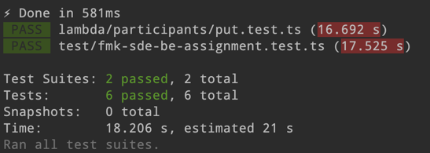

## FMK SDE BE Assignment

[](https://badge.fury.io/js/aws-cdk)


AWS CDK를 기반으로 이벤트 페이지를 통해 전달되는 고객 정보를 수집할 백엔드 API 서비스를 구현합니다.

### Requirements
- [AWS CDK](https://aws.amazon.com/cdk/)
- [Node.js](https://nodejs.org/)
- [Typescript](https://www.typescriptlang.org/)

### Install Essential Tools
- pre-commit
```shell
brew install pre-commit
pre-commit install
```

### Deployment
환경변수 설정 파일 수정하기(local 일 경우)
  1. 최상위 폴더의 .env.dev 파일을 복사하여 같은 폴더에 .env 파일을 생성합니다.(내용은 아래와 같습니다.)
```
TABLE_NAME=paticipants
```
[AWS CDK](https://aws.amazon.com/cdk/)를 사용하여 AWS 계정에 서비스를 배포합니다.
```shell
npm install
cdk synth
cdk bootstrap
cdk deploy --all
```

### Unit Test
```shell
npm run test
```

